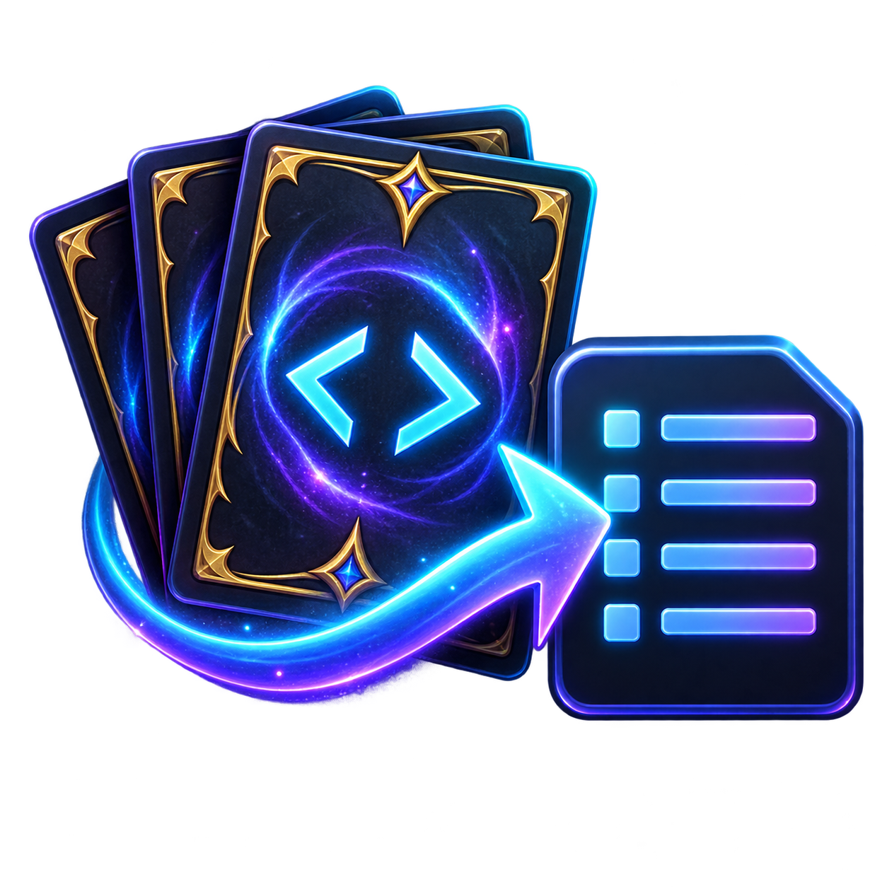

# MTGO Deck Exporter



A small Windows app that opens Magic Online `.dek` XML files and converts their card lists into formats accepted by deck-building sites.

The ready-to-run Windows executable is included at [`dist/MTGO Deck Exporter.exe`](dist/MTGO%20Deck%20Exporter.exe).

## Features

- Open by file picker, drag-and-drop, or double-clicking an associated `.dek` file
- Separates main deck and sideboard
- Moxfield, Archidekt, MTGGoldfish, Arena, plain-text, and CSV output
- Copy to clipboard or save to a file
- Per-user Windows file association (no administrator access required)

## Build and run

Requires the .NET 8 SDK or newer.

```powershell
.\build.ps1
& '.\dist\MTGO Deck Exporter.exe'
```

The normal build is a self-contained single executable. Use `build.ps1 -Portable` for a smaller executable that relies on the installed .NET Desktop Runtime.

## Associate `.dek` files

Run the built executable and click **Associate .dek files**. After that, double-clicking a `.dek` file opens it directly in the exporter. Windows may retain an existing user-selected default; if so, right-click a `.dek`, choose **Open with**, then select MTGO Deck Exporter once.

## Accepted MTGO XML

The parser supports the standard MTGO form:

```xml
<Cards Quantity="4" Sideboard="false" Name="Counterspell" />
```

It also tolerates `Card` elements, `Qty`/`Count`, `CardName`, `IsSideboard`, and `Zone="Sideboard"` variants.
